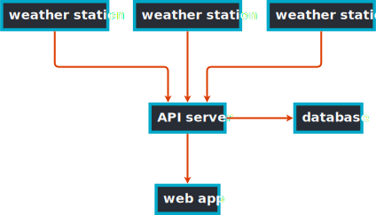

This is a monorepo with all the instructions and software to build and program your own solar-powered wi-fi weather station(s).

- [Overview](#overview)
- [Building the weather stations](hardware-files/README.md)
- [Arduino sketch README](sketch/README.md)
- [API server README](server/README.md)
- [Web app README](web-app/README.md)

## Overview

The weather stations send measurements to the API server to collect, which in turn serves this data to the web app that users load on their computer or mobile device.

<!-- (Flowchart generated using [gojs](https://gojs.net/latest/samples/flowchart.html). Load `diagram.json` onto their site to generate a new svg.) -->

**Folder structure:**

- **[hardware-files/](hardware-files/)** - All the files needed to print and build the weather station hardware
- **[sketch/](sketch/)** - Embedded software that runs on the weather stations
- **[server/](server/)** - API server
- **[web-app/](web-app/)** - Website/mobile app

**Milestones:**

- **Week 1**
  - [x] Project introduction
  - [x] Explanation of architecture
  - [x] Nodejs review
- **Week 2**
  - [x] API introduction
  - [x] fetching data in the web app
- **Week 3**
  - [x] Discussing Rust
  - [x] Database introduction
  - Web app workshop (part 1)
    - [x] Set up node.js
- **Week 4**
  - ESP8266 Workshop (part 1)
    - [x] Hardware and Arduino introduction
  - Web app workshop (part 2)
    - [x] Import a charting library for displaying data (#1)
    - [x] Discuss creating components
- **Week 5**
  - ESP8266 Workshop (part 2)
- [ ] Get the web app displaying data (see [GH issues](https://github.com/mtg137/weather-station/issues))
- [ ] API server workshop
- [ ] Deploying everything to the real world
- Optional features
  - [ ] Make app installable and full screen on mobile ([PWA demo](https://youtu.be/S7TIVG5F2xw))
  - [ ] Add time series filter (view weather over period of 1yr, 1mo, 1wk, 1dy)
  - [ ] Add latitude/longitude display
